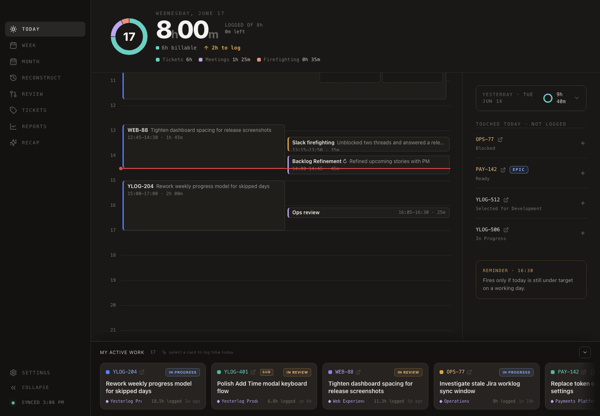
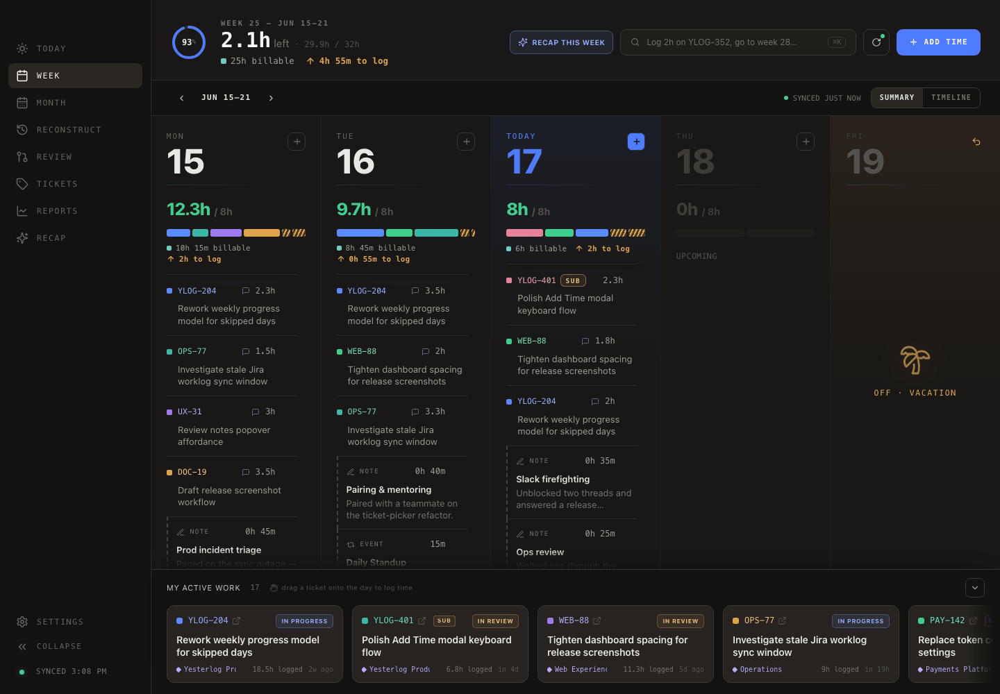
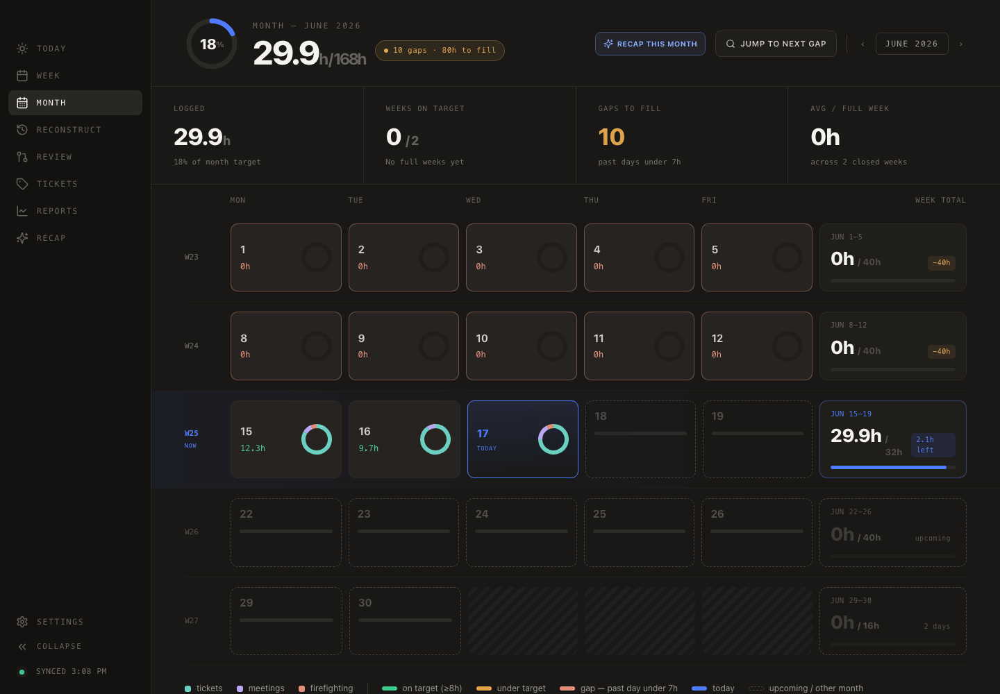
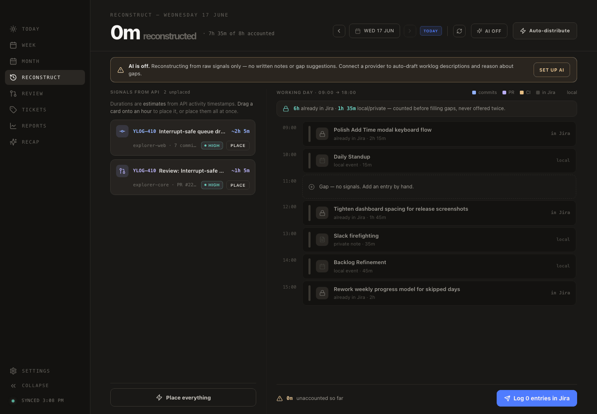
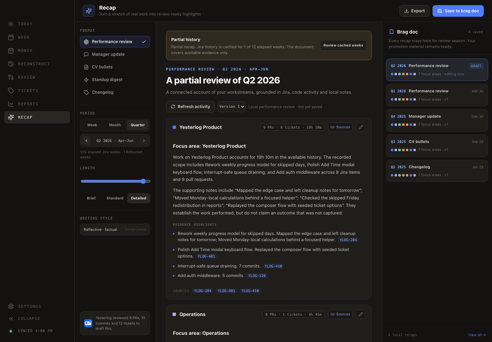
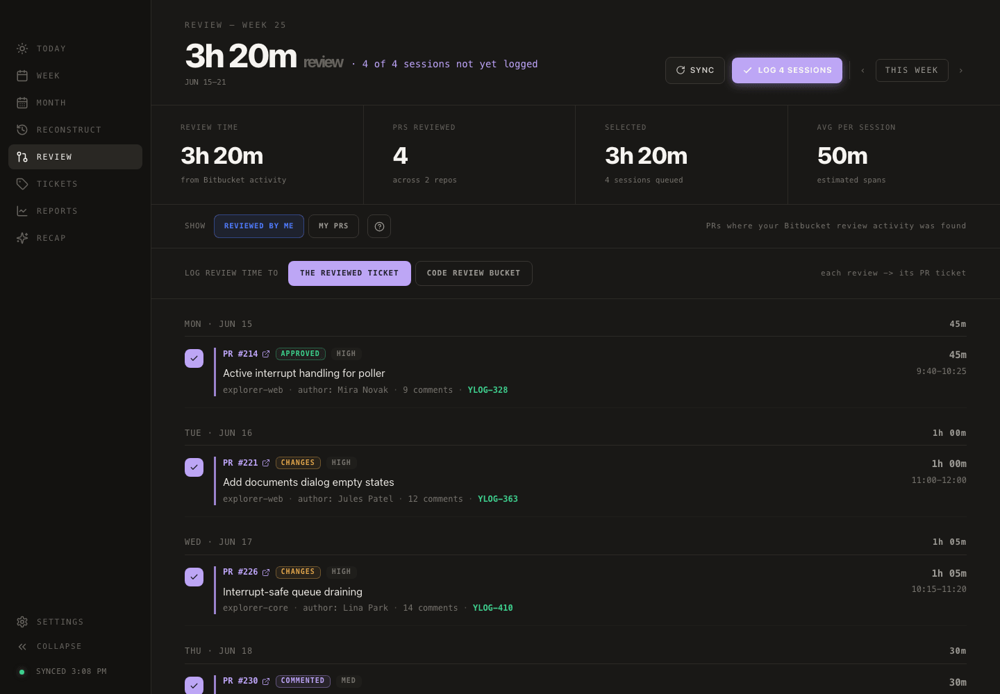
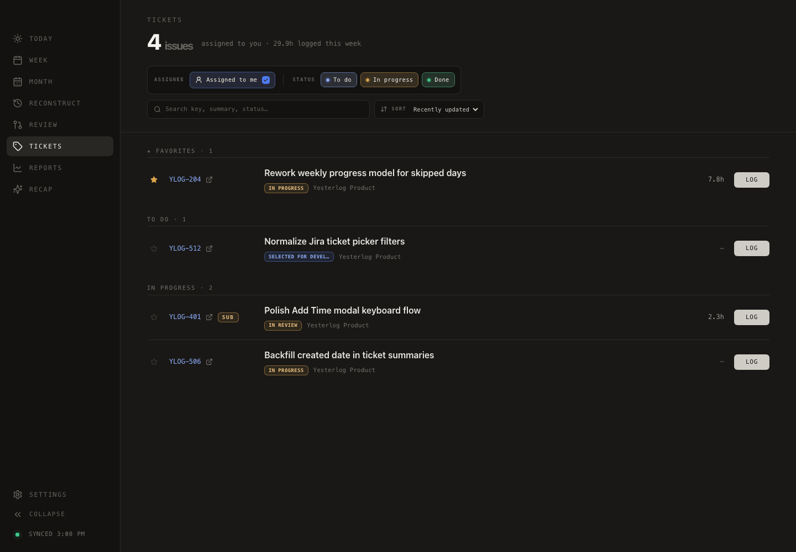
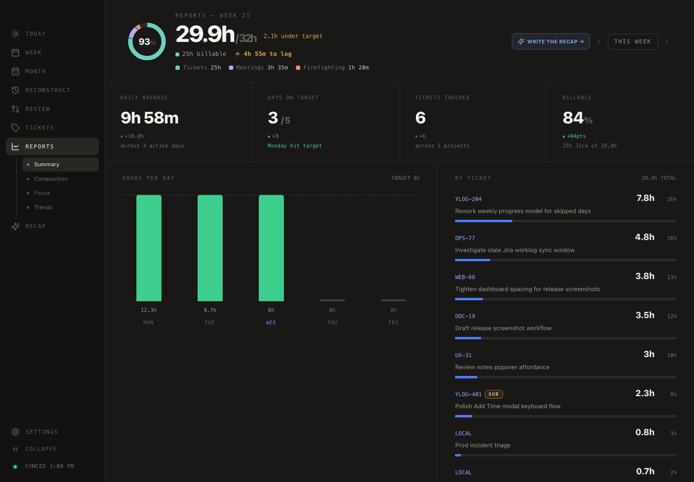
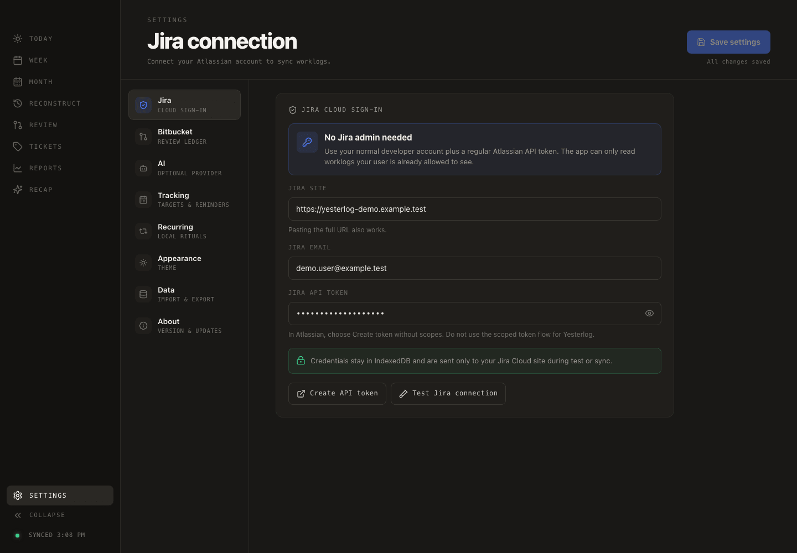

# Yesterlog features

[← Back to the main README](../README.md)

Yesterlog is a local-first work memory for developers who use Jira. It turns
the evidence you already leave behind into a record you can complete, inspect,
and reuse.

## The core workflow

- **Reconstruct.** Rebuild a forgotten day from Jira and optional Bitbucket
  activity. The deterministic core works without AI.
- **Complete.** Fill gaps with quick logging, drag-and-drop, timeline editing,
  recurring rituals, and local-only notes.
- **Recap.** Turn a week, month, or quarter into a standup, manager update,
  performance review, CV draft, or changelog.

## Product tour

### Today — log it before you forget it

Pick a ticket or search all of Jira, choose a duration, add an optional note,
and save. The Today calendar shows what is already recorded, what is still
missing, and which touched tickets have no worklog yet. Personal notes stay
local and never touch Jira.

  

### Week — see the whole record

The Week view combines daily targets, worklogs, recurring events, personal
notes, vacation handling, and the Active Work dock. Use the compact summary or
the aligned timeline, then drag active tickets directly onto a day.

  

### Month — find every gap

The month calendar is color-coded by target completion. Jump directly to the
next missing day instead of scanning Jira one week at a time.

  

### Reconstruct — rebuild a forgotten day

Reconstruct combines existing Jira worklogs and activity with optional
Bitbucket commits and pull-request reviews on a configurable day timeline.
Place signals by drag-and-drop or all at once, adjust durations, and fill the
remaining gaps through the existing Add Time flow.

The reconstruction engine is deterministic and fully usable without AI.
Optional AI can turn raw `fix npe` or `wip` activity into cleaner worklog
drafts. Choose local [Ollama](https://ollama.com), Anthropic through the Claude
CLI, or OpenAI through the Codex CLI. AI is off by default.

  

### Recap — turn history into something useful

Choose a week, month, or quarter and use the same grounded history to prepare:

- a performance review;
- a manager update;
- CV or résumé candidates;
- a standup digest;
- a changelog.

Switch between Brief, Standard, and Detailed output, inspect the source evidence
behind each workstream, edit the draft, compare versions, and optionally create
a separate AI-assisted rewrite. Export as text or Markdown, print to PDF, or
save an immutable snapshot to the local brag doc.

  

### Review — get credit for code review

The optional read-only Bitbucket integration estimates review sessions from
your real pull-request activity. Select the sessions to log, adjust their
durations, and send them to the reviewed Jira ticket or a dedicated code-review
bucket.

  

### Tickets — keep active work close

Browse assigned, in-progress, recently closed, and starred Jira tickets with
status, issue type, project context, and weekly logged hours. Open ticket
details or jump into Add Time with the ticket preselected.

  

### Reports — understand the recorded shape

Summary, Composition, Focus, and Trends pages show daily averages, days on
target, ticket totals, billable percentage, work composition, approximate focus
blocks, and week-over-week change. Export weekly data to CSV when a spreadsheet
is still required.

  

### Settings — make it yours

Connect Jira and optional Bitbucket, configure working days and targets,
schedule reminders, manage recurring rituals, choose an optional AI provider,
import or export local notes, and use light, dark, or system appearance.

  

## Detailed capabilities

### Worklogs and local entries

- Two-click logging with duration presets from 15 minutes to 8 hours.
- Custom **H / D / W** durations, with 1 day = 8 hours and 1 week = 5 days.
- Global `Cmd/Ctrl-K` shortcut.
- Drag-and-drop from Active Work onto a Week day or exact timeline time.
- Edit or delete Jira worklogs, including duration, date, start time, and note.
- Optional comments stored on the Jira work log item itself.
- Local-only personal notes that contribute to Yesterlog totals but never touch
  Jira.
- Optimistic refresh after writes.

### Reconstruction

- Jira worklogs, Jira issue activity, Bitbucket commits, and pull-request review
  signals.
- Configurable day timeline with visible elapsed-time limits for today.
- Per-signal placement, repositioning, removal, and duration overrides.
- Deterministic auto-distribution.
- Per-day draft persistence in IndexedDB.
- Optional signal-keyed AI drafts with an explicit Stop action.
- Local Ollama or opt-in Claude/Codex CLI providers.

### Recap and brag doc

- Week, month, and quarter intervals.
- Five purpose-specific formats and three detail levels.
- Grouping by workstream using Jira epic/project and repository context.
- Coverage warnings when the local history is incomplete.
- Source drawer for tickets, pull requests, commits, meetings, and local work.
- Local deterministic drafts, separate AI versions, and manual editing.
- Trusted user-entered outcomes for CV candidates.
- Local saved snapshots, plain-text copy, Markdown download, and print/PDF.

### Jira integration

- Regular Atlassian API token authentication with no Jira administrator access
  required.
- Monday-local worklog windows and filtering to the authenticated account.
- Search across Jira, not only assigned tickets.
- Assigned, in-progress, and recently closed ticket sync.
- Status, issue-type, epic, project, and direct Jira links.
- Automatic sync on launch.

### Bitbucket integration

- Optional read-only Bitbucket Cloud connection.
- Review sessions derived from comments, approvals, and review decisions.
- Separate handling for reviewed pull requests and activity on your own pull
  requests.
- Commit groups used as reconstruction and Recap evidence.
- Adjustable estimates, confidence labels, ignore controls, confirmation, and
  batch logging to Jira.

### Planning and insight

- Daily and weekly targets.
- Configurable working days and skipped/vacation days.
- Target redistribution across the remaining active week.
- Recurring local rituals for standups, planning, and ceremonies.
- Month gap discovery.
- Multi-page reports and CSV export.
- Deterministic projection of unusually long Jira worklogs across the days they
  represent without creating extra Jira writes.

### Desktop details

- Warm editorial design in light, dark, or system mode.
- Responsive layouts and collapsible navigation.
- Native reminder notifications.
- Sync, save, and update notifications.
- In-app release notes and update handling.
- Remembered window position and size.
- Import and export for personal notes.

For connection instructions, see [Getting started](./getting-started.md). For
storage and network behavior, see [Data and privacy](./privacy.md).
